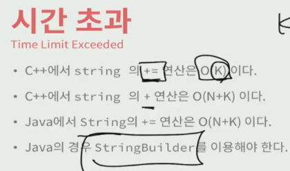
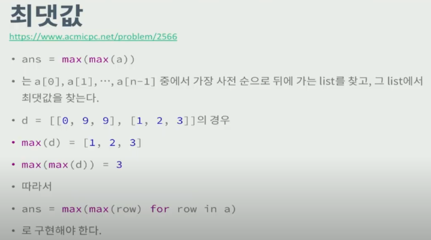
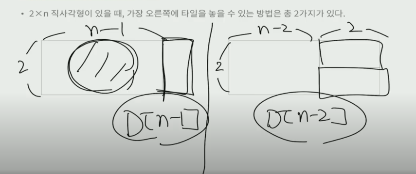
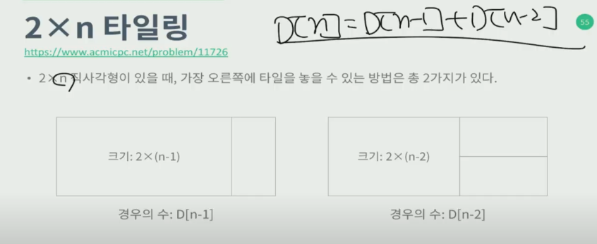
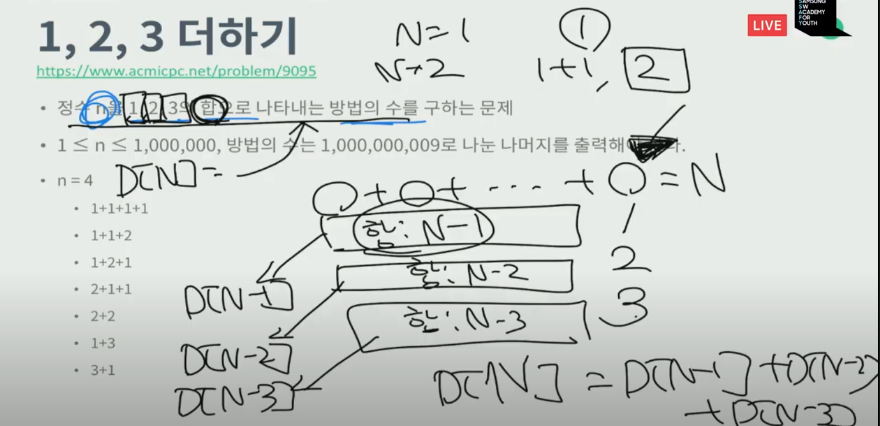
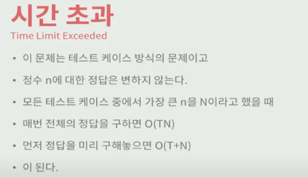
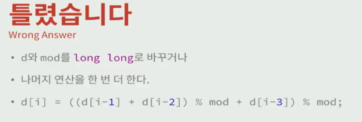
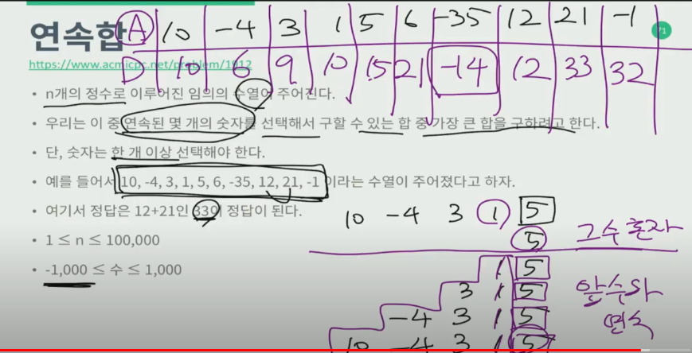
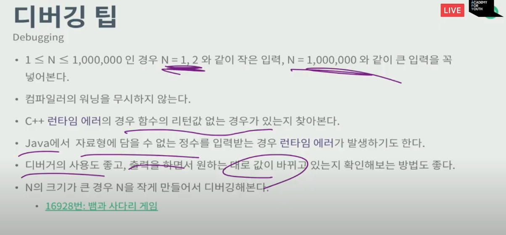

# 백준 특강

## 디버깅

틀리는 경우

```
시간초과
틀렸습니다.
런타임에러
```


틀리는 유형

```
출력 형식
출력 자료형 Overflow
```


좋지 않은 습관

```
같은 값을 여러번 호출

ex)
if (ans < go(day+1)){
	ans = go(day+1)
}
go(day+1) -> 중복 호출

=> 임시 변수에 저장해서 중복 호출을 피하자
temp = go(day+1)
```


**python으로 문제를 해결하는 경우 각 연산의 시간 복잡도를 알고 있어야 한다!**

pypy로 통과가 된다면 코드는 문제가 없는 것!


```
a = list(range(1, 10000001)) -> O(N)
a = a + [10000001] -> O(N) -> 크기가 N+1인 리스트를 다시 저장
a.append(10000001) -> O(1)
길이가 3이므로 M = 3
a = a + [1,2,3] -> O(N + M)
a.extend([1,2,3]) -> O(M)

!!!!가장 중요한 곳!!!!
a += [4, 5, 6] -> O(M)

if 10 in a:
	print(1) => O(N)
	
print(len(a)) => O(1)

```


런타임에러를 찾을 땐 경계값을 넣어보는 것이 중요!


vacuous truth => 중요!! 알아보자!

> 전제를 만족하는 것이 없으면 참 -> 연속하는 수를 판별할 때 수가 1개일 때도 연속인 이유


시간 초과

```
중복계산 문제
```

알아두자!




메모리 초과

```
다 저장 문제
```




python은 겐지나게 list comprehension ㄱㄱ


DP 방식

D[n] = 2*n을 채우는 방법의 수

다이나믹은 재귀로 문제를 품 -> 전체가 있을 때 전체의 마지막 단계를 찾는다.

왼쪽부터 순서대로 만들었을 때






DP 푸는법 2





모든 케이스를 다 구한 이후 원하는 값을 출력하는 것이 더 빠르다!!

일부 다이나믹 프로그래밍의 정답, 소수의 목록과 같은 것은

테스트 케이스의 값에 영향을 받지 않기 때문에, 미리 구해놓는 것이 항상 좋다!


숫자가 클 경우 나머지 연산은 자주 하는 편이 빠르다...!

C++을 사용할 때에는 OverFlow 조심!=>




선택할 수 있는 값이 마지막 수 혼자 or 전까지 수들의 합 + 마지막 수 이므로 둘중에 큰 숫자들을 선택한 표를 만들어 그중 가장 큰 값을 선택한다=> 개지림...




최대한 정수로 구한 뒤 마지막 출력시에 실수로 바꿔서 출력하는 것이 좋다


테스트 케이스 문제는 초기화가 핵심!

초기화를 검사하는 가장 쉬운 방법-> 테스트 케이스 순서 바꿔보기!!!


배열 범위 검사는 접근보다 먼저!!

문제 신경쓰지 말고 일관성 있게 사용하기

연산자 우선순위가 헷갈릴땐 그냥 괄호!


중복연산이 많을 때 시간초과가 많이 난다!!

제곱 연산은 실제로 실제로 값을 중복해서 계속 곱하는 연산이므로 자주 사용이 될 때에는 배열에 저장하여 중복을 피할 수 있게 하는것이 좋다


Python에서 is과 ==는 다르다!!!!!!





문제를 너무 오래 고민하지말고 적당히 고민한 이후 안풀리면 풀이를 찾아서 공부하자!!

-> 너무 끝까지 고민하는 것은 별로 좋지 않다! 모르면 배워서 풀자!

30분~1시간

풀이 코드를 이해하고 비슷한 문제를 풀어라~


시뮬레이션 -> 어떻게 구현? -> 어떻게 저장? -> 배열의 위치에 대상을 저장 or 대상에 배열의 위치를 저장 

ex)

```
A[r][c]: (r, c)
sharck[i]: ~~
```

 

정렬은 내장함수가 좋다


변수명은 일관성있게!

테스트 케이스는 랜덤으로 만들어보고 극단적인 상황을 고려한다


greedy는 대표적인 것 위주로 해도 된다!


골드 정도면 ㄱㅊ!


재귀함수 시간 복잡도 -> 함수의 깊이와 함수에서 호출하는 함수의 수를 곱한 것


정규표현식이란? 알아보기!!


시뮬레이션, 브루트 포스, bfs, 다이나믹, sql 정규 표현식, 이분 탐색, 정렬 알고리즘, 

카테고리 별로 문제푸는것도 추천!