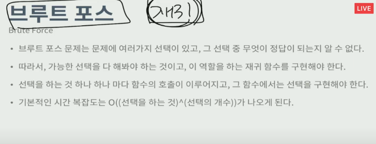

## 코딩테스트에 필요한 알고리즘들

시뮬레이션, 파싱, 브루트 포스, BFS + 다이나믹 프로그래밍

### 시뮬레이션

문제에서 어떤 동작을 제시했을 때 그대로 구현하면 되는 문제

-> 쉬운 문제 X

조건 => 코드로 구현

어떠한 과정을 자세하게 설명하는 부분이 존재 -> 이 부분을 보고 코드로 구현

### 파싱 parsing

파싱은 어떤 문자열을 의미있게 분해하는 것을 의미

### 브루트 포스

모든 경우의 수를 다 해보는 것

이 때, 경우의 수를 다 해보는데 걸리는 시간이 문제의 시간 제한을 넘지 않아야 한다.

1. 방법을 다 만들어 보는 것

2. 1에서 만든 방법을 이용해 답을 구함

   1(방법의 수) * 2(방법을 이용해 답을 구하는데 걸리는 시간)

브루트 포스 문제를 풀기 위해서는 다음과 같은 3가지 단계를 생각해볼 수 있다.

1. 문제의 가능한 경우의 수를 계산해본다. -> 스스로 생각 계산

2. 가능한 모든 방법을 다 만들어본다. -> 코드를 구현하는 다양한 방법들 ex) 반복,재귀 등

   **-> 재귀함수만 알아도 다 풀 수 있으니 재귀함수가 브루트 포스에서 가장 중요하다!**

3. 각각의 방법을 이용해 답을 구해본다.

   

대부분 재귀로 구현할 수 있다. 

- 순서: N개를 다함 -> N! -> 보통 N<=10
- 선택: N개 중에서 일부를 선택 -> 2^N 보통 N<=20

입력 조건을 보는게 중요!

입력 조건을 보고 시간 복잡도를 계산!

1억 -> 대략 1초

재귀함수의 실행 시간 => 함수의 깊이 * 호출되는 갯수

재귀함수로 구현을 할 때에는 **기준이 되는 대상**을 설정해 줘야 한다!!

ex) 6면체 주사위 N개를 던진다 => 기준: 주사위

1. 반찬, 주사위 등을 순서를 임의로 매겨 기준으로 설정
2. 이 기준을 앞에서 부터 구한다!
3. 순서가 딱히 상관이 없다면 1번부터 N번까지 무언가를 한다고 생각(동시에 던지나 순서대로 던지나 같다!)
4. 순서대로 먹는다 or 먹느냐 안먹느냐
5. 함수를 만들고 기준을 인자로 넣어서 구현한다
6. 내부에서 다음 인자를 함수에 넣고 호출하여 재귀함수를 구현한다!!

재귀로 순열조합 만들기 -> 기본중에 기본

- N과 M 1-8
- NM과 K 1

이 문제들만 다 풀 수 있어도 재귀로 푸는 브루트 포스 다 풀 수 있다!!

### BFS, DFS

목적: 임의의 정점에서 시작해서, 모든 정점을 한 번씩 방문하는 것

BFS -> 최단 거리를 구하는 알고리즘(모든 가중치가 1일 때)

BFS -> Q에 넣을때만 방문 검사!

그리디는 많이 풀고 증명을 본 뒤 이해하기!

트리 vs 루트가 있는 트리

면접 -> BST 중요!

문제를 많이 풀어랏!

KMP 알고리즘도 알아두면 좋다

