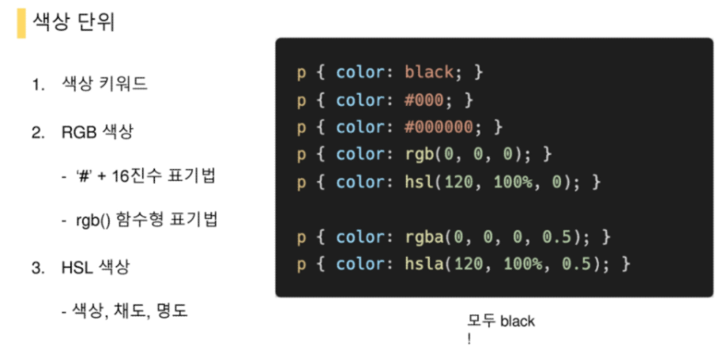
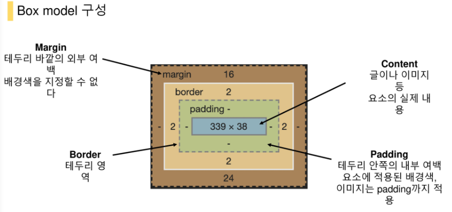
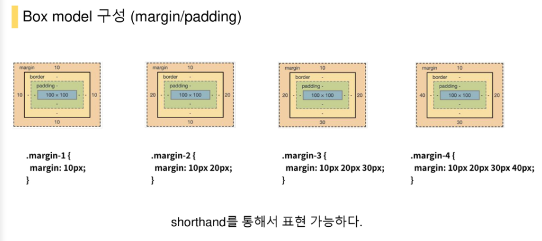
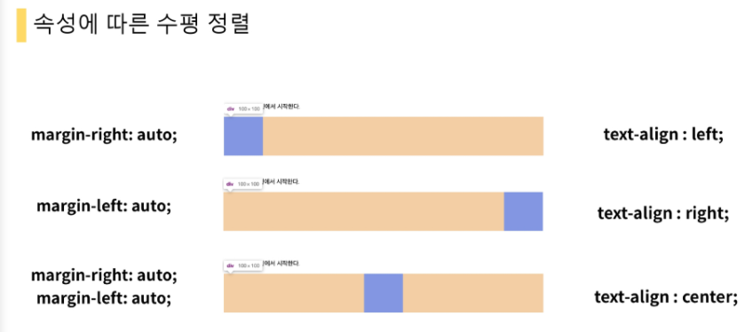
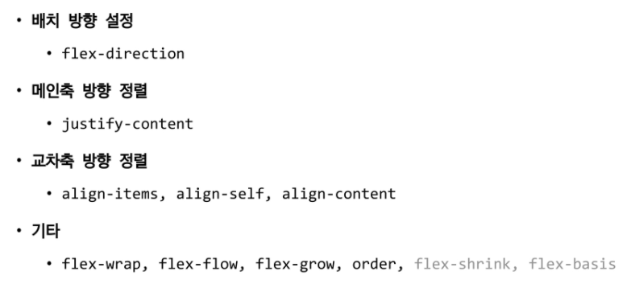

# Web 과목평가

PJT 03의 내용은 시험에 나오지 않음

ppt 보고 공부하기

## HTML

```
Hyper text
Markup -> 구조화

head와 body로 구분
head -> 문서 정보를 담고 있으며 브라우저에 나타나지 않음
요소의 속성값 대충 알아두기

시맨틱 태그 -> 의미론적 요소를 담은 태그 (대표적인 대그 몇가지 알아두기)

ppt에 나온 태그들은 다 알아두기


```


## CSS

## Bootstrap


# PPT

## HTML

```
51pg -> HTML GLobal Attribute
53pg -> 시맨틱 태그 (table, h1도 시맨틱 태그)
```

```
63pg ~ 69pg:
<pre> 입력한 그대로 화면에 나타내 주는 태그
<blockquote> 참조를 나태내는 코드로 속성으로 cite(참조)="https://~"를 가진다.
<b> -> 단순 굵게 <strong> 굵게 나타내는 동시에 강조의 효과 시맨틱 태그로 봐도 될듯
<i> -> 단순 기울임 <em>(emphasize) 기울임과 동시에 강조의 효과 시맨틱 태그로 봐도 될듯
<br> -> 줄바꿈
<tr> -> table row
<td> -> table column -> tr 하위 항목으로 위치
<th> -> table header -> header cell을 정의
<tbody>, <thead>, <tfoot> 시맨틱 태그의 역할 실질적인 효과나 의미는 존재하지 않지만 table을 구분할 때 사용
<caption> table을 설명해 주는 요소 <table>에 단 하나만 쓸 수 있으며 언제나 <table>요소 바로 뒤에 위치해야 함
셀 병합 속성(태그 아님) -> colspan, rowspan => ex) <td rowspan="2">
scope 속성 -> col 해당 셀이 열(column)을 위한 헤더 셀임을 명시함.
  			 row 해당 셀이 행(row)을 위한 헤더 셀임을 명시함.
 			 colgroup 해당 셀이 열의 그룹을 위한 헤더 셀임을 명시함.
			 rowgroup 해당 셀이 행의 그룹을 위한 헤더 셀임을 명시함.
<col> 태그는 <colgroup> 요소에 속하는 각 열(column)의 속성을 정의할 때 사용합니다.
<col> 요소는 각 행(row)이나 셀(cell)의 스타일을 반복하지 않고, 열(column)마다 각각 다른 스타일을 적용하고 싶을 때 유용하게 사용할 수 있습니다.
ex)<colgroup>
            <col style="background-color: lightgreen">
            <col span="2" style="background-color: yellow">
        </colgroup>
```

```
<input>
	<label> 서식 입력 요소의 캡션
	속성
	name="", palceholder="", required, autofocus
```

# CSS

```
CSS 정의 방법 -> 인라인(inline), 내부참조(embedding) -> <head>내에 <style> ,외부참조(link file) -> <link>
적용 우선순위 -> !important, 인라인, id, class, 요소, 소스 순서
상속 되는것 -> Text 관련 요소들(font, color, text-align), opacity, visiblity
(상대)크기 단위 : px, %, em, rem, vw, vh, vmin, vmax
```



```
margin, border, padding, content
```






```
기본적으로 box-sizing은 content-box
box-sizing을 border-box!
```

```
Margin collapsing 마진상쇄
인접 형제 요소 간의 margin이 겹쳐서 보임
블록의 top 및 bottom 마진은 때로는 (결합되는 마진 중 크기가) 가장 큰 한 마진으로 결합(combine, 상쇄(collapsed))됩니다
```

```
display: block -> 블록 요소 안에 인라인 레벨 요소가 들어갈 수 있다. -> 기본은 너비의 100% -> 너비가 아니면 마진으로 채운다.
display: inline ->content 너비만큼 가로, line-height로 상하 여백
블록 요소 -> div/ ul, ol, li / p / hr / form
인라인 요소 -> span/ a / img / input, label / b, em, i, strong

display: inline-block-> inline처럼 한 줄을 모두 차지하지 않지만 width, heigh, margin 등을 정의할 수 있다.
display: none -> 해당 요소를 화면에서 없앰(공간도 사라짐)
visibility: hidden -> 공간은 존재하나 보이지 않음
```



```
text-align -> content 내부에서 정렬
margin -> content 외부에서 정렬
```


### CSS position

```
static:디폴트 값 -> 기본적인 요소의 배치 순서에 따름(좌측 상단), 부모요소 내에서 배치될 때는 부모 요소의 위치를 기준으로 배치 된다.

relative: static 위치를 기준으로 이동(상대 위치)
**relative는 기존의 공간 배치는 그대로 두고 요소의 위치만 옮겨진다.**

absolute: static이 아닌 가장 가까이 있는 부모/조상 요소를 기준으로 이동(절대 위치)

**absolute는 부모나 조상을 기준으로 이동하고 나머지 요소들은 이 요소를 무시하고 배치된다.**

fixed:  부모 요소와 관계 없이 브라우저를 기준으로 이동( 고정 위치), 스크롤시에도 항상 같은 곳에 위치
```


참고

```
MDN
EMMEt
```


Float

```
foat: left;
float: right;

.clearfix::after{
	content: "";
	display: block;
	clear: both;
}
```





- `.flex-row`
- `.flex-row-reverse`
- `.flex-column`
- `.flex-column-reverse`
- `.justify-content-start`
- `.justify-content-end`
- `.justify-content-center`
- `.justify-content-between`
- `.justify-content-around`
- `.justify-content-evenly`
- `.align-items-start`
- `.align-items-end`
- `.align-items-center`
- `.align-items-baseline`
- `.align-items-stretch`
- `.align-items-sm-start`
- `.align-items-sm-end`

```
<div class="container">
  <div class="row">
    <div class="col-sm-8">col-sm-8</div>
    <div class="col-sm-4">col-sm-4</div>
  </div>
  <div class="row">
    <div class="col-sm">col-sm</div>
    <div class="col-sm">col-sm</div>
    <div class="col-sm">col-sm</div>
  </div>
</div>
```

